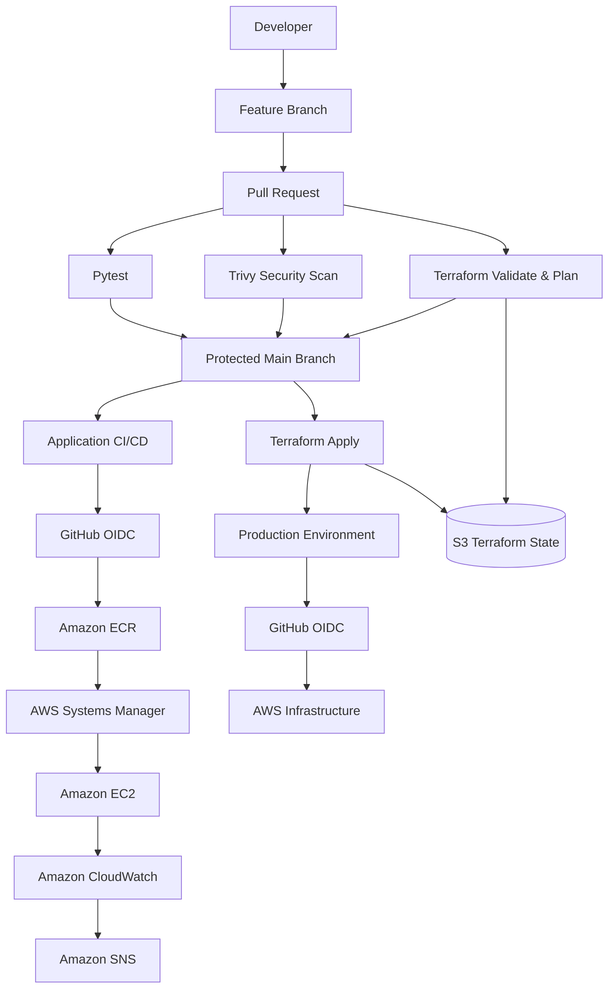

# AWS CI/CD DevOps Lab

A production-style DevOps project demonstrating automated CI/CD, Infrastructure as Code, security scanning, monitoring, deployment, health checks, and automatic rollback on AWS.

The project uses GitHub Actions with AWS OpenID Connect (OIDC), eliminating the need to store long-lived AWS credentials in GitHub.

The environment includes application CI/CD, Terraform infrastructure automation, Amazon ECR, EC2, AWS Systems Manager, CloudWatch monitoring, SNS alerting, and S3 remote Terraform state.

---

## Architecture



---

## Technology Stack

### Cloud

- Amazon EC2
- Amazon ECR
- AWS IAM
- AWS Systems Manager
- Amazon CloudWatch
- CloudWatch Logs
- Amazon SNS
- Amazon S3

### Infrastructure as Code

- Terraform
- S3 Remote State

### CI/CD

- GitHub Actions
- GitHub OIDC
- GitHub Environments
- Protected branches
- Pull Request checks

### Containers & Application

- Docker
- Python
- Flask
- Gunicorn
- Nginx

### Testing & Security

- Pytest
- Trivy vulnerability scanner

---

## Application

The project contains a small Flask backend used to demonstrate the complete CI/CD lifecycle.

The application exposes:

```text
/
```

which returns application information and:

```text
/health
```

which is used by the deployment pipeline to verify application health.

Example health response:

```json
{
  "status": "healthy"
}
```

The application runs inside a Docker container on Amazon EC2.

```text
Host port 3001
      ↓
Docker container
      ↓
Flask / Gunicorn
      ↓
Port 3000
```

---

## CI/CD Pipeline

Application deployments are automated using GitHub Actions.

A push to the protected `main` branch starts the deployment pipeline.

```text
Push / Merge to main
        ↓
Automated Tests
        ↓
Docker Build
        ↓
Package Verification
        ↓
Trivy Security Scan
        ↓
Amazon ECR
        ↓
AWS Systems Manager
        ↓
Amazon EC2
        ↓
Health Check
        ↓
Deployment Success / Rollback
```

Docker images are tagged using the Git commit SHA, providing traceability between source code and deployed containers.

The pipeline also publishes a `latest` image tag.

---

## Pull Request CI & Security Checks

Changes are developed on feature branches and submitted through pull requests.

Before code can be merged into `main`, GitHub runs required checks.

### Automated Tests

Pytest validates application functionality before deployment.

Current tests verify:

- `/health`
- application root endpoint
- expected application metadata

A failing test prevents the change from reaching the deployment pipeline.

### Docker Security Scan

The application Docker image is scanned using Trivy.

The pipeline checks:

```text
CRITICAL
HIGH
```

vulnerabilities across:

```text
OS packages
Library dependencies
```

The workflow fails when unresolved HIGH or CRITICAL vulnerabilities are detected.

This prevents vulnerable images from being pushed into the deployment process.

---

## Protected Main Branch

The `main` branch is protected using GitHub repository rules.

Configured protections include:

- Pull request required before merge
- Required status checks
- Branch deletion protection
- Force push protection
- Squash merge workflow

Required application checks include:

```text
Automated Tests
Docker Security Scan
Terraform Validate
```

This ensures changes cannot bypass the CI and security pipeline.

---

## AWS Authentication with GitHub OIDC

GitHub Actions authenticates with AWS using OpenID Connect.

No permanent AWS access keys are stored in GitHub Secrets.

The authentication flow is:

```text
GitHub Actions
      ↓
OIDC Token
      ↓
AWS STS
      ↓
IAM Role
      ↓
Temporary AWS Credentials
```

Separate IAM roles are used for different responsibilities.

Examples include:

```text
GitHubActions-ECR-aws-cicd-devops-lab

GitHubActions-TerraformPlan-aws-cicd-devops-lab

GitHubActions-TerraformApply-aws-cicd-devops-lab
```

This separates application deployment, Terraform planning, and infrastructure modification permissions.

---

## Automated EC2 Deployment

Application deployment is performed using AWS Systems Manager instead of direct SSH access from GitHub Actions.

GitHub Actions sends deployment commands to the EC2 instance using SSM.

The deployment process:

```text
GitHub Actions
      ↓
AWS OIDC
      ↓
AWS Systems Manager
      ↓
EC2
      ↓
Pull Docker image from ECR
      ↓
Start container
      ↓
Health check
```

The deployed container is:

```text
cicd-backend
```

with port mapping:

```text
3001:3000
```

---

## Health Check & Automatic Rollback

The deployment pipeline performs an application health check after starting the new Docker image.

It checks:

```text
http://localhost:3001/health
```

If the new application responds successfully, the deployment completes.

If the health check fails, the pipeline automatically restores the previously deployed Docker image.

```text
Deploy new image
      ↓
Health Check
     / \
   OK   FAIL
   ↓      ↓
Success  Stop failed container
          ↓
       Previous image
          ↓
       Restart container
          ↓
        Rollback
```

Rollback behavior was intentionally tested by deploying an unhealthy application version.

The pipeline failed as expected while the previous healthy application remained available.

---

# Infrastructure as Code with Terraform

The AWS infrastructure used by this project is managed with Terraform.

Terraform configuration covers resources including:

- EC2 instance
- Security Group
- IAM role
- IAM instance profile
- Amazon ECR repository
- CloudWatch log groups
- CloudWatch alarms
- CloudWatch dashboard
- Amazon SNS topic

---

## Terraform Remote State

Terraform state is stored remotely in Amazon S3.

```text
aws-cicd-devops-lab-terraform-state-303974373642
```

Remote state allows Terraform to maintain a consistent infrastructure state between local development and GitHub Actions.

This replaces reliance on a local `terraform.tfstate` file for CI/CD operations.

---

## Terraform CI

Terraform changes are validated automatically during pull requests.

The Terraform CI workflow performs:

```text
terraform fmt -check
        ↓
AWS OIDC Authentication
        ↓
terraform init
        ↓
terraform validate
        ↓
terraform plan
```

Terraform Plan uses the dedicated IAM role:

```text
GitHubActions-TerraformPlan-aws-cicd-devops-lab
```

The Plan role is designed for infrastructure inspection and Terraform planning without providing the permissions used by the Apply workflow to modify infrastructure.

This allows infrastructure changes to be reviewed before they are applied.

---

## Terraform Apply

Infrastructure changes are applied only after changes reach the protected `main` branch.

The Terraform Apply workflow uses the GitHub:

```text
production
```

environment.

The workflow performs:

```text
Merge to main
      ↓
Terraform Apply workflow
      ↓
GitHub Production Environment
      ↓
GitHub OIDC
      ↓
Terraform Apply IAM Role
      ↓
terraform init
      ↓
terraform validate
      ↓
terraform plan
      ↓
terraform apply
      ↓
AWS Infrastructure
```

The Apply workflow uses:

```text
GitHubActions-TerraformApply-aws-cicd-devops-lab
```

This role is separate from the Terraform Plan role.

---

## Terraform Deployment Safety

Infrastructure changes follow a pull-request-based workflow.

1. Terraform code is modified on a feature branch.
2. A pull request is opened against `main`.
3. Application tests run.
4. Docker security scanning runs.
5. Terraform formatting is checked.
6. Terraform configuration is validated.
7. Terraform generates an execution plan.
8. Required GitHub checks must pass.
9. The pull request is squash-merged.
10. Terraform Apply runs from `main`.
11. AWS infrastructure is updated.

A successfully tested infrastructure change produced:

```text
Plan: 0 to add, 1 to change, 0 to destroy.
```

followed by:

```text
Apply complete! Resources: 0 added, 1 changed, 0 destroyed.
```

The existing EC2 instance was updated in-place without replacing or destroying the resource.

---

# Monitoring & Observability

Amazon CloudWatch provides monitoring and observability for the environment.

The EC2 instance uses the CloudWatch Agent to collect additional system metrics and logs.

Monitoring includes:

- CPU utilization
- Memory utilization
- Disk utilization
- Network traffic
- EC2 status checks
- Nginx access logs
- Nginx error logs
- Nginx latency logs
- HTTP 4xx errors
- HTTP 5xx errors
- Request rate
- Response time

---

## CloudWatch Logs

Nginx logs are sent to dedicated CloudWatch Log Groups:

```text
/devops-lab/nginx/access

/devops-lab/nginx/error

/devops-lab/nginx/latency
```

CloudWatch Logs Insights is used to analyze application and proxy traffic.

Examples include:

- Top requested URLs
- HTTP status codes
- HTTP status classes
- Top external IPs causing errors
- Slowest Nginx URLs
- Nginx response time
- Request rate
- HTTP methods
- 5xx errors over time

---

## CloudWatch Dashboard

The project includes a centralized CloudWatch dashboard:

```text
devops-lab-dashboard
```

The dashboard provides visibility into infrastructure health and application traffic.

Metrics include:

```text
CPU Utilization
Memory Used %
Disk Used %
Network Traffic
EC2 Status Check
Nginx 4xx Errors
Nginx 5xx Errors
Nginx Response Time
```

---

## CloudWatch Alarms

CloudWatch alarms monitor infrastructure and application health.

Configured alarms include:

```text
devops-lab-ec2-status-check
devops-lab-high-cpu
devops-lab-high-memory
devops-lab-high-disk
devops-lab-nginx-4xx
devops-lab-nginx-5xx
```

Amazon SNS is used to deliver alarm notifications.

---

# Incident Simulation & Recovery

The environment was intentionally tested using failure scenarios.

## Application Failure

The backend application was intentionally stopped to reproduce:

```text
502 Bad Gateway
```

The incident was visible through Nginx and CloudWatch monitoring.

After restoring the backend, successful HTTP responses were confirmed.

## CI Failure

A test expectation was intentionally changed to an invalid application version.

Pytest failed as expected and GitHub Actions prevented deployment.

This demonstrated that failing application tests block releases.

## Security Failure

Trivy was configured to fail the CI pipeline when HIGH or CRITICAL vulnerabilities were detected.

Package and container security issues were investigated and resolved before deployment was allowed.

## Deployment Failure

An unhealthy application deployment was intentionally triggered.

The health check failed and the deployment workflow restored the previous healthy Docker image.

This verified automatic rollback behavior.

---

# Security

The project applies several security practices:

- AWS authentication through GitHub OIDC
- No long-lived AWS access keys in GitHub
- Dedicated IAM roles
- Separate Terraform Plan and Apply permissions
- Protected `main` branch
- Required pull request checks
- Trivy container vulnerability scanning
- HIGH and CRITICAL vulnerability enforcement
- Automated application testing
- SSM-based deployment
- Docker image SHA tagging
- Health checks
- Automatic rollback
- S3-backed Terraform state

---

# Repository Structure

```text
aws-cicd-devops-lab/
│
├── .github/
│   └── workflows/
│       ├── deploy.yml
│       ├── pr-check.yml
│       ├── terraform.yml
│       └── terraform-apply.yml
│
├── app/
│   ├── app.py
│   └── requirements.txt
│
├── nginx/
│   └── default.conf
│
├── terraform/
│   ├── backend.tf
│   └── ...
│
├── test/
│   └── test_app.py
│
├── compose.yaml
├── Dockerfile
└── README.md
```

---

# What This Project Demonstrates

This lab demonstrates practical experience with:

- AWS cloud infrastructure
- Infrastructure as Code
- Terraform
- CI/CD architecture
- GitHub Actions
- AWS OIDC federation
- IAM roles and permissions
- Docker containerization
- Amazon ECR
- Amazon EC2
- AWS Systems Manager
- Automated testing
- Container security scanning
- Pull request quality gates
- Protected production branches
- Automated deployment
- Health checks
- Automatic rollback
- CloudWatch monitoring
- Centralized logging
- Infrastructure alerting
- Remote Terraform state
- Incident simulation and recovery

The project is designed to reproduce a practical production-style DevOps workflow rather than a simple deployment demo.